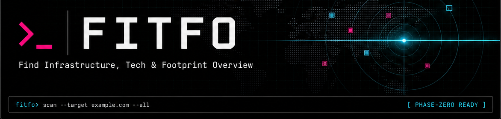

# FITFO



[](LICENSE)


**Figure It The Fuck Out for clients.**

Client-safe meaning: **Find Infrastructure, Tech & Footprint Overview**.

FITFO is a command-line onboarding scanner for the first layer of a client website handoff: who controls the domain, where DNS lives, what hosting/CMS/email clues are public, what subdomains might exist, and what access the client needs to track down.

Motto: **Kickstarting onboarding.**

## Quick Start

Install globally:

```bash
npm install -g fitfo
fitfo onboard clientdomain.com
```

From this folder:

```bash
npm link
fitfo onboard clientdomain.com
```

`fitfo onboard` is the main intake command. It runs the client handoff scan and saves a Markdown planning note unless you pass `--no-save`.

## Report Modes

- `snapshot`: a light first-call walkthrough.
- `brief`: a deeper first-call prep packet.
- `plan`: a build-planning report with structure, workstreams, launch checks, and current-state mapping.
- `onboard`: the full intake path with a saved Markdown note.

The default deliverable is Markdown. Obsidian is treated as a destination for Markdown files, not a separate report format.

## Built By

FITFO is built by Will Schmierer, a builder, developer, strategist, and agentic engineer with 20+ years of WordPress experience, 25 years of construction leadership, and hands-on agency work across client onboarding, web systems, automation, and local service business growth.

- [willschmierer.com](https://willschmierer.com)
- [BuiltWTF.com](https://builtwtf.com)
- [resume.willschmierer.com](https://resume.willschmierer.com)

It exists because client onboarding should not start from a blank page. FITFO turns public domain, infrastructure, website, and marketing signals into a working Markdown brief before the first strategy call, redesign plan, or launch checklist.

## Install Locally

```bash
npm link
fitfo doctor
```

If the linked command does not refresh after edits:

```bash
npm unlink -g fitfo
npm link
```

## Common Commands

Fast technical scan:

```bash
fitfo example.com
```

Full onboarding run:

```bash
fitfo onboard example.com
```

Light first-call walkthrough:

```bash
fitfo snapshot example.com --deep --location "Richmond, VA"
```

First-call prep brief:

```bash
fitfo brief example.com --deep --location "Richmond, VA"
```

Build-planning report:

```bash
fitfo plan example.com --deep --location "Richmond, VA"
```

Guided interactive mode:

```bash
fitfo
```

## Output Options

Show defaults:

```bash
fitfo config
```

Save Markdown to a file:

```bash
fitfo brief example.com --format markdown --out reports/example.md
```

Save Markdown into a vault or client folder:

```bash
fitfo brief example.com --obsidian --vault ~/Obsidian/Clients
```

Set useful defaults once:

```bash
fitfo config set vault ~/Obsidian/Clients
fitfo config set location "Richmond, VA"
fitfo config set format obsidian
```

## What FITFO Checks

- RDAP / WHOIS-style domain records
- registrar and domain status clues
- nameservers and DNS provider hints
- A / AAAA / CNAME / SOA records
- MX, SPF, DMARC, DNSSEC, and CAA
- Cloudflare or CDN-like signals
- hosting fingerprints from DNS, reverse DNS, ASN/network owner, headers, and page data
- WordPress and common CMS/page-builder signals
- analytics, marketing, CRM, booking, and form clues visible from public signals
- common subdomains such as `www`, `staging`, `dev`, `app`, `portal`, `shop`, `blog`, `booking`, `mail`, `webmail`, `crm`, and `admin`
- TLS certificate and HTTP/HTTPS redirect behavior

## What FITFO Produces

The report is designed for onboarding, not just technical trivia.

Core sections include:

- **Verdict**: registrar, DNS provider, Cloudflare status, hosting, CMS, email, and services.
- **Infrastructure Snapshot**: public ownership and provider clues.
- **Unknowns Blocking Work**: blockers that must be assigned before build or launch work.
- **Call One Workflow**: found, need, risk, ask, owner, and audience.
- **Why FITFO Thinks This**: confidence notes and public evidence.
- **Login / Access Checklist**: day-one accounts to track down.
- **Do Not Touch Until Confirmed**: DNS, email, Cloudflare/CDN, redirects, lead tracking, hosting, and subdomain warnings.
- **Client Handoff Summary**: public findings, confidence, and client follow-up.
- **Site Intelligence**: when `--deep` is used, page-level signals from reachable public pages.

## Important Limits

FITFO is best-effort public reconnaissance.

- It does not prove ownership.
- It cannot see private DNS zones, private dashboards, credentials, billing accounts, or unpublished client systems.
- Hosting can be hidden behind Cloudflare, WP Engine edge, or another CDN/proxy.
- Previous developer contact usually cannot be discovered from public records.
- DNS records can be incomplete or intentionally hidden.
- Subdomain discovery is intentionally passive.

## Data Hygiene

Do not commit scan output, client reports, secrets, API keys, credentials, or `.env` files.

Generated reports are ignored by default through:

- `fitfo-reports/`
- `reports/`
- `fitfo-exports/`

## Project Docs

- [Core scope](docs/CORE.md)
- [Setup](docs/SETUP.md)
- [Install](docs/INSTALL.md)
- [Interactive onboarding](docs/INTERACTIVE.md)
- [Examples](docs/EXAMPLES.md)
- [Provider fixtures](docs/PROVIDER_FIXTURES.md)
- [Contributing](CONTRIBUTING.md)
- [Security](SECURITY.md)
- [Changelog](CHANGELOG.md)

Future-facing plans, private strategy, release checklists, website planning, and optional add-on strategy live in the private `fitfo-pro` repository.

## Development

Run checks:

```bash
npm run check
npm test
```

Package dry run:

```bash
npm run pack:dry-run
```

## Licensing

FITFO is licensed as **GPL-2.0-or-later**.
