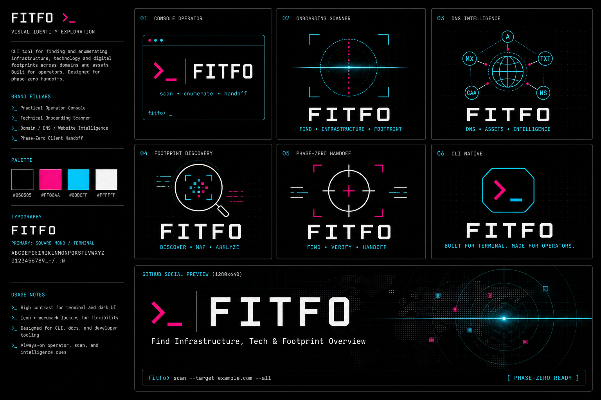

# FITFO One-Page Website Brief

## Purpose

Create a focused one-page WordPress site for FITFO that explains the product clearly, shows why it exists, and gives the right next action without turning the page into a full documentation site.

The page should position FITFO as a practical client-onboarding CLI for domain, DNS, hosting, website, access, and redesign-planning discovery.

## Primary Audience

- agency operators who inherit unclear client website setups
- WordPress builders who need day-one infrastructure clarity
- technical SEO and local-service marketers who need to protect traffic, redirects, citations, tracking, and lead flow during redesigns
- future open-source contributors who can help improve provider detection fixtures

## Primary Message

FITFO turns a client domain into a practical onboarding map: what exists, who likely controls it, what must be confirmed, and what needs to happen before a redesign or launch.

## Page Goal

The page should make a visitor understand:

- what FITFO does
- when to use it
- what reports it produces
- why it reduces onboarding and launch risk
- how to run it locally
- that it is currently private / early, with open-source intent later

## First-Viewport Direction

The first viewport should show the product name, the CLI nature of the tool, and a real-looking terminal/report signal.

Use the current logo/brand concept sheet as the first visual reference:



Recommended hero content:

- headline: `FITFO`
- subhead: `Find Infrastructure, Tech & Footprint Overview for client website handoffs.`
- supporting copy: `Scan a domain, map ownership and launch risks, and turn public signals into a first-call plan.`
- primary action: `View GitHub`
- secondary action: `Read the workflow`

The visual should feel like a polished operator console, not a SaaS marketing dashboard. Use black, hot pink, electric blue, and restrained white/gray text.

## Core Sections

### 1. Hero / Product Signal

Purpose: explain FITFO immediately.

Content:

- FITFO name
- client-safe expansion
- one-sentence value prop
- compact command example:

```bash
fitfo onboard clientdomain.com
```

Visual:

- terminal-style preview with fake output
- no real client domains

### 2. What FITFO Maps

Purpose: show the scanner scope.

Content buckets:

- Domain and registrar
- DNS and nameservers
- Cloudflare / CDN
- Hosting and CMS
- Email safety
- Analytics, CRM, booking, field-service tools
- Subdomains
- Redirect and canonical host behavior

### 3. Report Modes

Purpose: make the command set understandable.

Rows:

- `snapshot`: light first-call walkthrough
- `brief`: deeper prep and research packet
- `plan`: current-state to future-state build plan
- `onboard`: full intake with notes and table exports

### 4. Architectural State Map

Purpose: explain the redesign/rebuild angle.

Content:

- current state assessment
- architectural decisions
- redesign phase handling
- launch and post-launch redirect strategy

Plain-language framing:

FITFO helps avoid treating a redesign like a blank slate. It maps what already exists so important URLs, subdomains, forms, tracking, and redirects are intentionally kept, reworked, deprecated, or redirected.

### 5. Why It Matters

Purpose: connect technical discovery to business risk.

Risks FITFO helps prevent:

- lost DNS/email access
- hidden Cloudflare or hosting ownership
- broken lead forms or tracking
- missed staging/portal/shop subdomains
- apex/www redirect mistakes
- lost local SEO or service-page equity
- launch without rollback path

### 6. Install / Run

Purpose: make the page useful to a technical visitor.

Content:

```bash
npm link
fitfo doctor
fitfo snapshot example.com --deep
fitfo plan example.com --deep --search --location "City, ST"
fitfo onboard example.com
```

Note that the repo is private for now and public release will use fake/demo examples only.

### 7. Status / Roadmap

Purpose: set expectations.

Content:

- private-first tool
- GPL-2.0-or-later
- dependency-free Node CLI
- fixture-driven provider detection
- public release later after more real-domain validation

## Image / Asset Needs

Use only fake domains and fake report output.

Current imported brand asset:

- [FITFO logo concept sheet](assets/fitfo-logo-concept-sheet-2026-05-01.png)

Use this as the starting brand direction for:

- logo / wordmark lockup
- terminal prompt icon
- black, hot pink, electric blue, white palette
- mono-terminal typography direction
- GitHub social preview concept
- first-viewport product signal

Recommended README/site assets:

- cropped logo/wordmark export from the concept sheet
- cropped GitHub social preview export from the concept sheet
- terminal screenshot: `fitfo --help`
- terminal screenshot: `fitfo snapshot example.com --client-safe`
- terminal screenshot or SVG mock: architectural state map table
- small diagram: domain input to scan, snapshot, brief, plan, onboard

Do not use private scan output, client names, screenshots with local paths, API keys, account IDs, or real client reports.

## WordPress Content Model

For a one-page WordPress build, this can be a normal page using block patterns:

- Hero
- Feature grid
- Command/report mode section
- Architectural state map section
- Risk/prevention section
- Install/status section
- Footer

The page should be easy to edit in the block editor, with reusable patterns if we build a lightweight theme.
